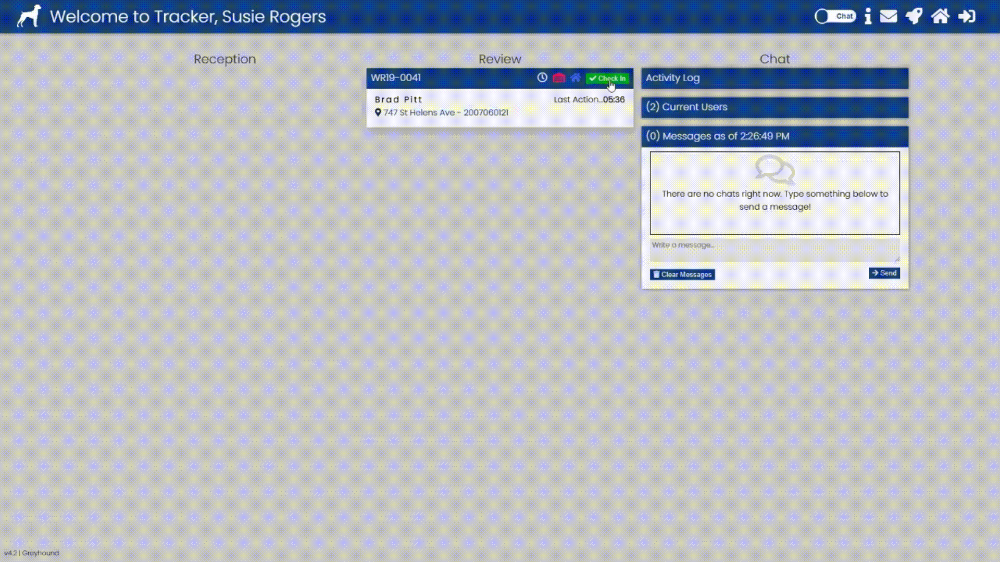

# Tracker

**Tracker** is a powerful Node.js web application that manages our customers that walk into our office with questions related to aquiring a permit. Tracker allows staff to view details on the nature of a customers request, route customers to internal subject matter experts, send notification emails to staff, log notes about the conversation with the customer as well as track the staff time spent. This application is built to integrate specifically with the Accela Civic Platform using the Accela Construct API's. Accela is the backbone and primary data storage location of the data being tracked in this application. See below for more details on how to configure Tracker with your Accela Civic Platform configuration. 

## Installation

Due to the way Tracker was initially developed, there are a lot of specific requirements needed to run Tracker for your organization. This application is NOT a plug-and-play solution. We have done our best to generalize as much as possible to ease your development, but we suggest using our code as a starting point when you are developing your own application. The Tracker features we include:
- Node.js packages
	- fs (used for reading files on the server)
	- mysql (used for connecting to your user database)
	- request (used for making http calls to Accela)
	- nodemailer (used for sending emails)
	- socket.io (used for communicating between client/server)
	- diet (used to run multiple apps on the same server)
	- diet-static (used to send folder of static files to clients)
	- gulp (used for compiling js and scss into single files)
- MySQL Database for storing user data (See [schemaDump.sql](./resources/schemaDump.sql) for table definitions)
- ESRI ArcGIS server containing Address and Parcel data 
- Accela Civic Platform Walk-in Record Type to store data and control workflow (see the Accela Record Example screenshots in the [resources](./resources) folder)
- Accela Civic Platform custom scripting to update shortnotes (see [Accela Tracker EMSE code](./resources/AccelaTrackerEMSE.js))

## Usage

Once node is installed run the command below to startup the application.

```bash
node path/to/server/file.js path/to/config/file.json
```

Then in your browser, navigate to the url you provided in the config file to connect to Tracker.

Below is a few examples of Trackers features in action:
- **Creating a new record and routing to staff (a new customer walks into our office)**
	

- **Sending emails to staff (based on department and custom lookup)**
	

- **Department staff checking customers in/out**
	

- **Multiple user chat**
	

## Support

Our team is always happy to help answer any questions you may have about how to get a Tracker-like app up and running for your agency. Please email us at tacomapermits@cityoftacoma.org.

## Roadmap

Tracker is always being improved by our team. We refer to the current major version of Tracker as Version 4. Be on the look out for version 5! Want to learn more about why we built Tracker? We gave a presentation at the 2018 Accelarate conference in Atlanta, GA about how Tracker improved our customer service. You can view our presentation [here](https://www.youtube.com/watch?v=su5GPOZdjA0).

## Related Apps

The iTeam has built a customer-facing application for displaying the current customers waiting in the lobby to work in conjunction with Tracker called the **Queue Monitor**. Check out our implementation [here](https://github.com/tacoma-pds-iteam/Queue-Monitor).  

## Authors

Tracker was built by the City of Tacoma Planning & Development Services Innovation Team (iTeam). The following iTeam members have contributed to the development of Tracker:
- Casey Jamrog
- Nathan Connors
- Daniel Jauch

## Acknowledgements

We would like to thank [FontAwesome](https://fontawesome.com/) for providing the icons used in Tracker. 

## License

Tracker is licensed under [MIT](https://opensource.org/licenses/MIT).
